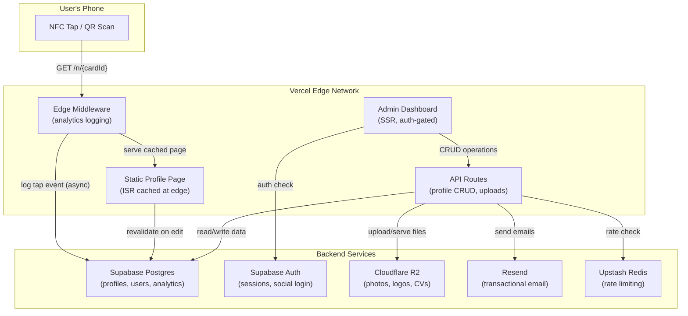
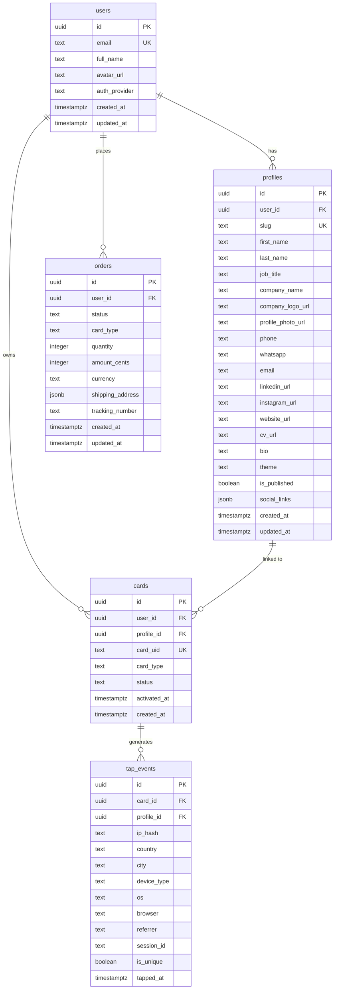

# TapThat — NFC Business Card Platform MVP Implementation Plan

## Executive Summary

Build a professional identity platform where an NFC card tap opens a blazing-fast (<200ms) profile page with instant "Save Contact" — no app required. The admin portal lets card owners edit profiles, view analytics, and manage cards.

This plan covers a **free-tier-only** tech stack, a detailed phased rollout across **6–8 weeks**, database schema design, architecture decisions, and a verification strategy.

---

## Recommended Tech Stack (Free Tier)

| Layer | Technology | Free Tier Limits | Rationale |
|:------|:-----------|:----------------|:----------|
| **Framework** | **Next.js 15 (App Router)** | N/A (open source) | Single codebase for profile pages (SSG/ISR), admin dashboard (SSR), and API routes. Massive ecosystem, first-class TypeScript, excellent auth/ORM integrations. |
| **Hosting** | **Vercel (Hobby)** → upgrade to Pro at commercial launch | 100 GB bandwidth, 1M function invocations, 6k build mins/mo | Best-in-class Next.js deployment. ISR + Edge Middleware = <200ms profile loads globally. |
| **Database** | **Supabase (Postgres)** | 500 MB storage, 50k MAUs (auth), unlimited rows | Industry-standard Postgres with Row Level Security, integrated auth, realtime subscriptions, and a generous free tier. Won't auto-pause with regular traffic. |
| **Auth** | **Supabase Auth** | 50,000 MAUs | Integrated with DB (no extra service), supports Google/Apple/LinkedIn social login, email/password, magic links. Zero auth infrastructure to maintain. |
| **File Storage** | **Cloudflare R2** | 10 GB storage, **$0 egress forever** | Profile photos, company logos, and CV/resume PDFs. Zero bandwidth cost regardless of traffic spikes — critical for a tap-heavy product. |
| **ORM** | **Drizzle ORM** | Open source | Type-safe, lightweight, excellent Postgres support, generates migrations, works at the edge. |
| **Styling** | **Tailwind CSS 4 + shadcn/ui** | Open source | Rapid development of premium UI. shadcn/ui provides polished, accessible components (dialogs, charts, data tables) without vendor lock-in. |
| **Charts** | **Recharts** (via shadcn/ui charts) | Open source | Analytics dashboard visualizations — line charts, bar charts, pie charts for tap data. |
| **Email** | **Resend** | 3,000 emails/mo (100/day) | Welcome emails, password resets, card registration confirmations. Modern API with React Email template support. |
| **vCard** | **Custom TypeScript helper** | N/A | Zero-dependency RFC 6350 compliant vCard generator. Runs at the edge with no cold start penalty. |
| **Wallet Passes** | **`passkit-generator`** + Google Wallet REST API | Google: free; Apple: $99/yr dev account | Generate `.pkpass` for iOS and JWT-signed Google Wallet passes. |
| **Validation** | **Zod** | Open source | Schema validation for all API inputs and form data. |
| **Rate Limiting** | **Upstash Redis** | 10k commands/day, 256 MB | Rate limit public API endpoints (tap logging, vCard downloads) to prevent abuse. |

---

## Architecture Overview



### Key Architectural Decisions

**1. Profile Page Delivery Strategy: ISR (Incremental Static Regeneration)**
- Profile pages are **statically generated at build time** and cached at Vercel's global edge CDN.
- When a card is tapped, the edge serves the cached HTML in **<50ms** — no database query needed.
- When a user edits their profile in the admin portal, we call `revalidatePath('/n/[cardId]')` to regenerate only that page.
- This achieves the **<200ms** target while keeping the database load near zero for public traffic.

**2. NFC URL Routing: Direct Serve (No Redirect)**
- Card URL: `https://tapthat.ae/n/{cardId}` → directly renders the profile page.
- Avoids an extra 100–300ms redirect hop.
- Edge Middleware intercepts the request to log the tap event **asynchronously** (non-blocking), then serves the static page.
- Optional vanity URL: `https://tapthat.ae/p/{username}` for sharing on social media and email signatures.

**3. Analytics Ingestion: Edge Middleware + Postgres**
- Every tap hits Edge Middleware which extracts geolocation, device, OS, and browser from headers/UA.
- The tap event is written to Supabase Postgres asynchronously via `waitUntil()` (non-blocking).
- At MVP scale (<100k taps/month), Postgres with proper indexing handles this workload trivially.
- When scaling beyond 1M events/month (V3), migrate analytics to a dedicated time-series DB (Tinybird/ClickHouse).

**4. File Storage: Separate from Database**
- Profile photos, logos, and CVs are stored in **Cloudflare R2** (not Supabase Storage) to avoid egress costs.
- Upload flow: Admin dashboard → API route generates a presigned R2 upload URL → client uploads directly to R2 → URL stored in Postgres.
- Serving: R2 public bucket URL served via Cloudflare's CDN with aggressive caching headers.

---

## Database Schema Design



### Key Schema Notes

- **`profiles.slug`**: URL-friendly unique identifier (e.g., `umar-khan`). Used for vanity URLs `/p/{slug}`.
- **`cards.card_uid`**: The unique ID programmed into the NTAG215 chip. Maps to `/n/{card_uid}`.
- **`cards.status`**: Enum of `unregistered → active → deactivated → replaced`.
- **`tap_events.ip_hash`**: SHA-256 hash of the visitor's IP for GDPR compliance (no raw IPs stored).
- **`tap_events.is_unique`**: Determined by checking if `session_id` has been seen before for this card in the last 24 hours.
- **`tap_events.session_id`**: Generated from a cookie or fingerprint to track unique vs. returning visitors.
- **`profiles.social_links`**: JSONB field for flexible additional links (Twitter/X, TikTok, Behance, GitHub, etc.) without schema migrations.
- **Row Level Security (RLS)**: All tables have RLS policies so users can only read/write their own data via Supabase client.

### Indexes for Analytics Performance

```sql
-- Fast lookup for profile page rendering
CREATE INDEX idx_cards_card_uid ON cards(card_uid) WHERE status = 'active';
CREATE INDEX idx_profiles_slug ON profiles(slug) WHERE is_published = true;

-- Fast analytics queries
CREATE INDEX idx_tap_events_card_time ON tap_events(card_id, tapped_at DESC);
CREATE INDEX idx_tap_events_profile_time ON tap_events(profile_id, tapped_at DESC);

-- Aggregation queries (country breakdown, device breakdown)
CREATE INDEX idx_tap_events_country ON tap_events(profile_id, country, tapped_at DESC);
CREATE INDEX idx_tap_events_device ON tap_events(profile_id, device_type, tapped_at DESC);
```

---

## Phased Implementation Plan

### Phase 1: Foundation (Week 1–2)

> Project scaffolding, database, authentication, and admin layout.

#### Week 1: Project Setup & Auth

| Task | Details |
|:-----|:--------|
| **Next.js project init** | `create-next-app` with App Router, TypeScript, Tailwind CSS 4, ESLint, `src/` directory |
| **Supabase project setup** | Create project, configure DB connection string, install `@supabase/supabase-js` and `@supabase/ssr` |
| **Drizzle ORM setup** | Define schema in TypeScript, configure `drizzle-kit` for migrations, push initial schema |
| **Supabase Auth integration** | Email/password signup + login, Google OAuth, Apple OAuth, LinkedIn OAuth, session management via cookies |
| **Middleware auth guard** | Protect `/dashboard/*` routes, redirect unauthenticated users to `/login` |
| **Cloudflare R2 setup** | Create bucket, generate API keys, configure presigned URL generation in API routes |
| **Resend setup** | API key, verified domain, welcome email template |

#### Week 2: Admin Dashboard Shell

| Task | Details |
|:-----|:--------|
| **Dashboard layout** | Sidebar navigation, responsive design, user avatar/menu, dark mode support |
| **shadcn/ui component install** | Button, Input, Card, Dialog, Sheet, Tabs, Avatar, Badge, Dropdown, Toast, Skeleton |
| **Dashboard pages (empty shells)** | `/dashboard` (overview), `/dashboard/profile` (edit), `/dashboard/analytics`, `/dashboard/cards`, `/dashboard/orders` |
| **Settings page** | Account settings (name, email, password change), danger zone (delete account) |

---

### Phase 2: Profile System (Week 3–4)

> Profile CRUD, file uploads, public profile page, vCard generation.

#### Week 3: Profile Management (Admin Side)

| Task | Details |
|:-----|:--------|
| **Profile edit form** | All fields from scope: name, title, company, phone, WhatsApp, email, LinkedIn, Instagram, website, bio |
| **Profile photo upload** | Crop/resize UI → presigned R2 upload → store URL in DB |
| **Company logo upload** | Same flow as profile photo |
| **CV/resume upload** | PDF upload to R2 (max 10 MB), store URL, show download link |
| **Slug/username selection** | Unique slug picker with availability check, auto-generate from name |
| **Profile preview** | Live preview of how the public profile page will look |
| **Publish/unpublish toggle** | Control profile visibility |

#### Week 4: Public Profile Page & vCard

| Task | Details |
|:-----|:--------|
| **Public profile page (`/n/[cardId]` and `/p/[slug]`)** | ISR-rendered, mobile-first, <200ms load time, premium design |
| **Profile page design** | Glassmorphism/modern card design, smooth animations, responsive across all devices |
| **"Save Contact" button** | Generates vCard (.vcf) on the fly, triggers download — no app required |
| **vCard generation API** | Custom TS helper generating RFC 6350 compliant vCard with all contact fields + profile photo embedded |
| **Social link buttons** | Tap to open LinkedIn, Instagram, WhatsApp (with `wa.me` deep link), email (`mailto:`), phone (`tel:`) |
| **CV download button** | Direct download from R2 |
| **SEO meta tags** | Open Graph, Twitter Card, structured data (Person schema) for link previews when sharing |
| **QR code endpoint** | Generate QR code image for the profile URL (for printing on card backs) |

---

### Phase 3: Analytics & Card Management (Week 5–6)

> Tap event logging, analytics dashboard, card registration.

#### Week 5: Analytics Engine

| Task | Details |
|:-----|:--------|
| **Edge Middleware (tap logging)** | Intercept `/n/[cardId]` requests, extract geolocation (Vercel headers), device/OS/browser (UA parsing), log to `tap_events` via `waitUntil()` |
| **Unique visitor tracking** | Set a cookie (`tap_session`) to distinguish unique vs. returning visitors |
| **IP hashing** | SHA-256 hash of IP + daily salt for GDPR compliance |
| **Rate limiting** | Upstash Redis rate limiter on tap endpoint to prevent analytics spam |
| **Analytics API routes** | `/api/analytics/summary` (totals), `/api/analytics/timeseries` (daily/monthly), `/api/analytics/breakdown` (country, device, OS, browser) |

#### Week 6: Analytics Dashboard & Card Management

| Task | Details |
|:-----|:--------|
| **Analytics dashboard UI** | Total taps counter, unique visitors, returning visitors (big number cards) |
| **Time series chart** | Line/area chart showing daily taps over last 30 days, toggle to monthly view |
| **Breakdown charts** | Pie/donut charts for country, device type, OS, browser distributions |
| **Date range picker** | Filter analytics by last 7 days, 30 days, 90 days, custom range |
| **Card registration flow** | User enters card UID (printed on card packaging) → links card to their profile |
| **Card management UI** | List of registered cards, status badges, activate/deactivate, link to different profile |
| **Order replacement card** | Simple form to request a replacement card (stores order in DB, sends email notification) |

---

### Phase 4: Wallet Passes, Polish & Launch (Week 7–8)

> Apple/Google Wallet, email notifications, performance optimization, QA.

#### Week 7: Wallet Integration & Emails

| Task | Details |
|:-----|:--------|
| **Apple Wallet pass generation** | `passkit-generator` to create `.pkpass` files with profile info, NFC card URL, and branding. Requires Apple Developer account ($99/yr). |
| **Google Wallet pass generation** | Google Wallet REST API + JWT signing. Create pass class + object with profile URL, contact info. Completely free. |
| **"Add to Wallet" buttons** | On public profile page and admin dashboard — detect iOS vs Android, show appropriate button |
| **Transactional emails** | Welcome email, card registered confirmation, profile published notification, password reset |
| **Email templates** | React Email + Resend for beautiful, branded transactional emails |

#### Week 8: Polish, Optimization & Launch

| Task | Details |
|:-----|:--------|
| **Performance audit** | Lighthouse scores, Core Web Vitals, profile page load time testing from multiple regions |
| **Image optimization** | Next.js `<Image>` component with R2 loader, WebP/AVIF conversion, responsive sizes |
| **Error handling** | Global error boundaries, 404 page, card-not-found page, profile-not-published page |
| **Loading states** | Skeleton loaders for dashboard, optimistic updates for profile edits |
| **Mobile responsiveness** | Test on iPhone, Android, tablet — especially the public profile page |
| **Security hardening** | CSP headers, CORS configuration, input sanitization, SQL injection prevention (Drizzle handles this) |
| **DNS & domain setup** | Configure `tapthat.ae` (or chosen domain), SSL certificate, Vercel custom domain |
| **Production deployment** | Environment variables, database backups, monitoring setup |
| **QA & testing** | End-to-end testing of: signup → create profile → register card → tap card → view analytics |

---

## Project Structure

```
src/
├── app/
│   ├── (auth)/                    # Auth pages (no sidebar)
│   │   ├── login/page.tsx
│   │   ├── signup/page.tsx
│   │   └── layout.tsx
│   ├── (dashboard)/               # Admin dashboard (sidebar layout)
│   │   ├── dashboard/
│   │   │   ├── page.tsx           # Overview
│   │   │   ├── profile/page.tsx   # Profile editor
│   │   │   ├── analytics/page.tsx # Analytics dashboard
│   │   │   ├── cards/page.tsx     # Card management
│   │   │   ├── orders/page.tsx    # Order history
│   │   │   └── settings/page.tsx  # Account settings
│   │   └── layout.tsx             # Dashboard layout with sidebar
│   ├── (public)/                  # Public pages (no auth required)
│   │   ├── n/[cardId]/page.tsx    # NFC tap → profile page (ISR)
│   │   ├── p/[slug]/page.tsx      # Vanity URL → profile page (ISR)
│   │   └── layout.tsx
│   ├── api/
│   │   ├── profile/route.ts       # Profile CRUD
│   │   ├── upload/route.ts        # Presigned R2 upload URLs
│   │   ├── vcard/[profileId]/route.ts  # vCard download
│   │   ├── analytics/             # Analytics endpoints
│   │   ├── cards/route.ts         # Card registration
│   │   ├── wallet/                # Wallet pass generation
│   │   └── webhooks/              # Supabase auth webhooks
│   ├── layout.tsx                 # Root layout
│   └── page.tsx                   # Landing page
├── components/
│   ├── ui/                        # shadcn/ui components
│   ├── dashboard/                 # Dashboard-specific components
│   ├── profile/                   # Profile page components
│   └── shared/                    # Shared components (navbar, footer)
├── lib/
│   ├── db/
│   │   ├── schema.ts              # Drizzle schema definitions
│   │   ├── migrations/            # SQL migrations
│   │   └── index.ts               # DB client
│   ├── supabase/
│   │   ├── client.ts              # Browser client
│   │   ├── server.ts              # Server client
│   │   └── middleware.ts          # Auth middleware
│   ├── r2/
│   │   └── index.ts               # R2 upload/download helpers
│   ├── vcard.ts                   # vCard generator
│   ├── analytics.ts               # Tap event processing
│   ├── wallet/
│   │   ├── apple.ts               # Apple Wallet pass generation
│   │   └── google.ts              # Google Wallet pass generation
│   └── utils.ts                   # Shared utilities
├── middleware.ts                   # Next.js middleware (auth + tap logging)
└── types/                         # TypeScript type definitions
```

---

## Cost Projection

### MVP Phase (0–1,000 users, <10k profile views/month)

| Service | Free Tier | Monthly Cost |
|:--------|:----------|:-------------|
| Vercel Hobby | 100 GB bandwidth, 1M invocations | **$0** |
| Supabase Free | 500 MB DB, 50k MAUs, 1 GB storage | **$0** |
| Cloudflare R2 | 10 GB storage, $0 egress | **$0** |
| Resend | 3,000 emails/month | **$0** |
| Upstash Redis | 10k commands/day | **$0** |
| Apple Developer | Required for Wallet passes | **$8.25/mo** ($99/yr) |
| Domain (`.ae`) | Annual registration | ~**$5/mo** (~$60/yr) |
| **Total** | | **~$13/mo** |

### Growth Phase (1,000–10,000 users, ~100k views/month)

| Service | Plan | Monthly Cost |
|:--------|:-----|:-------------|
| Vercel Pro | 1 TB bandwidth, commercial use | **$20/mo** |
| Supabase Pro | 8 GB DB, 100k MAUs | **$25/mo** |
| Cloudflare R2 | Still within free tier | **$0** |
| Resend | 50k emails/month | **$20/mo** |
| Upstash Pro | Higher limits | **$10/mo** |
| **Total** | | **~$88/mo** |

> [!TIP]
> Infrastructure stays **under $100/month** even at 10,000 users — well within the $200/month budget from the scope document.

---

## User Review Required

> [!IMPORTANT]
> **Vercel Commercial Use**: Vercel's free Hobby tier is **non-commercial only**. For MVP development and private beta, this is fine. Once you start charging customers, you'll need to upgrade to Vercel Pro ($20/month). This is factored into the Growth Phase costs above. Alternatively, we could deploy to **Cloudflare Pages** (unlimited bandwidth, commercial use allowed on free tier) using the OpenNext adapter — but it's less mature for Next.js than Vercel's native platform.

> [!IMPORTANT]
> **Apple Developer Account**: Apple Wallet pass generation requires a $99/year Apple Developer Program membership. This is an Apple requirement, not a tooling cost. If budget is tight, we can **defer Apple Wallet to post-MVP** and launch with Google Wallet only (completely free).

> [!WARNING]
> **Supabase Auto-Pause**: Supabase free tier projects pause after **7 days of inactivity**. For an active product, this shouldn't be an issue. However, during early development when the app may go untouched for a week, you'll need to manually unpause it. This has no data loss risk — it just adds a ~5 second cold start on the first request after resuming.

---

## Open Questions

> [!IMPORTANT]
> **1. Domain Name**: Is the domain `tapthat.ae` already registered? Or are you considering alternatives? The NFC card URL scheme (`https://domain.com/n/{cardId}`) depends on this. A short domain is ideal (fewer bytes on the NFC chip, faster to scan).

> [!IMPORTANT]
> **2. Tailwind CSS vs Vanilla CSS**: This plan recommends Tailwind CSS 4 + shadcn/ui for rapid, premium UI development. The scope doc emphasizes an "Apple-like experience" and "premium feel" — shadcn/ui's polished components accelerate this significantly. Are you comfortable with Tailwind, or do you prefer vanilla CSS?

> [!IMPORTANT]
> **3. Card Registration Flow**: How will the card UID mapping work?
> - **Option A**: Each card has a unique UID printed on its packaging. User enters this UID in the admin dashboard to link it to their profile.
> - **Option B**: Each card comes with a QR code on the packaging that links to a registration page (pre-filled with the card UID).
> - **Option C**: Cards ship pre-linked to the user's account (you handle mapping during fulfillment).
> Which approach do you prefer?

> [!NOTE]
> **4. Multi-Language Support (Arabic)**: The scope mentions GCC markets. Should the MVP support Arabic (RTL layout) from day one, or is English-only acceptable for the initial launch?

> [!NOTE]
> **5. Landing Page**: Should the root URL (`tapthat.ae/`) be a marketing landing page (hero, features, pricing, CTA) or just redirect to the login/signup page? A landing page significantly helps SEO and conversions but adds ~2–3 days of development.

> [!NOTE]
> **6. NFC Pre-Programming Workflow**: How are you handling card manufacturing and NFC programming?  
> - Are you sourcing blank NTAG215 cards and programming them yourself?
> - Or working with a manufacturer who programs the URLs during production?
> - This affects whether we need to build a batch card provisioning tool in the admin portal.

---

## Verification Plan

### Automated Tests
```bash
# Unit tests for vCard generation, analytics processing, schema validation
npx vitest run

# End-to-end tests for critical flows
npx playwright test
```

### Performance Verification
- **Profile page load time**: Test with `curl` from multiple regions (US, UAE, EU, Pakistan) — target <200ms TTFB
- **Lighthouse audit**: Target scores of 95+ on Performance, Accessibility, Best Practices, SEO
- **Core Web Vitals**: LCP <1.0s, FID <50ms, CLS <0.05 on profile pages

### Manual Verification
- **NFC tap flow**: Program a test NTAG215 card → tap on iPhone (iOS 15+) and Android → verify profile loads instantly
- **vCard download**: Tap "Save Contact" on iOS Safari, Android Chrome, desktop browsers → verify contact appears in phone's contacts app
- **Analytics accuracy**: Tap card 10 times from different devices → verify analytics dashboard shows correct counts, device/country breakdowns
- **Auth flow**: Test signup, login, Google OAuth, password reset on mobile and desktop
- **File uploads**: Upload profile photo (JPEG, PNG, WebP), company logo, CV (PDF) — verify display on profile page
- **Wallet pass**: Add to Apple Wallet (iOS) and Google Wallet (Android) — verify pass contains correct profile URL and contact info

---

**Timeline**: 6–8 weeks from approval to production launch.  
**Team**: Optimized for a solo developer or 2-person team.  
**Goal**: Launch with 100 paying customers in the first 3 months. 🚀
